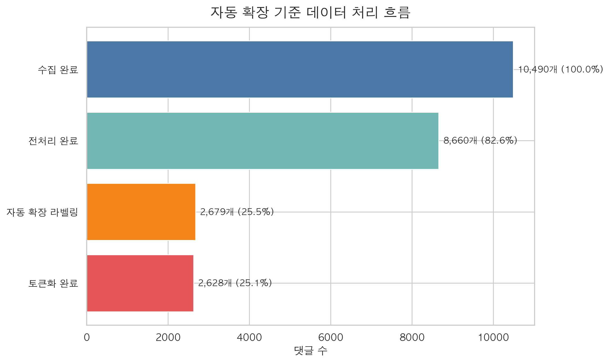
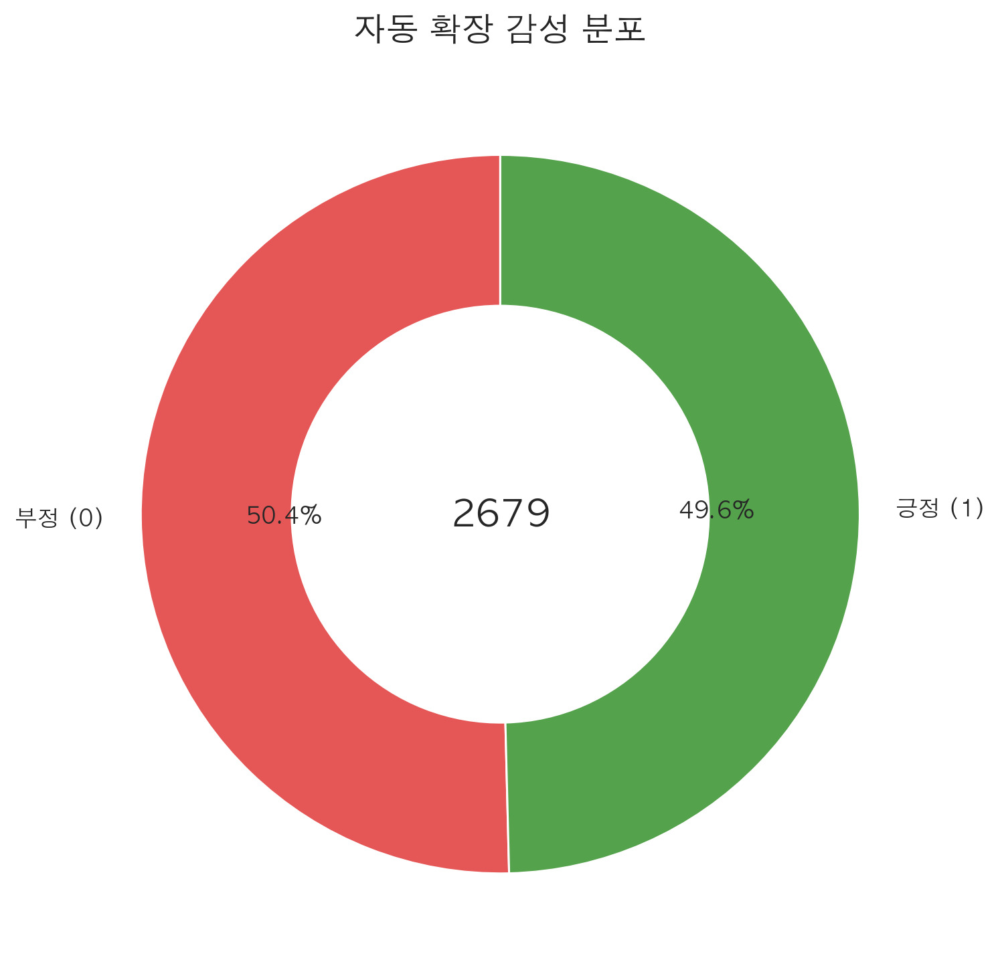
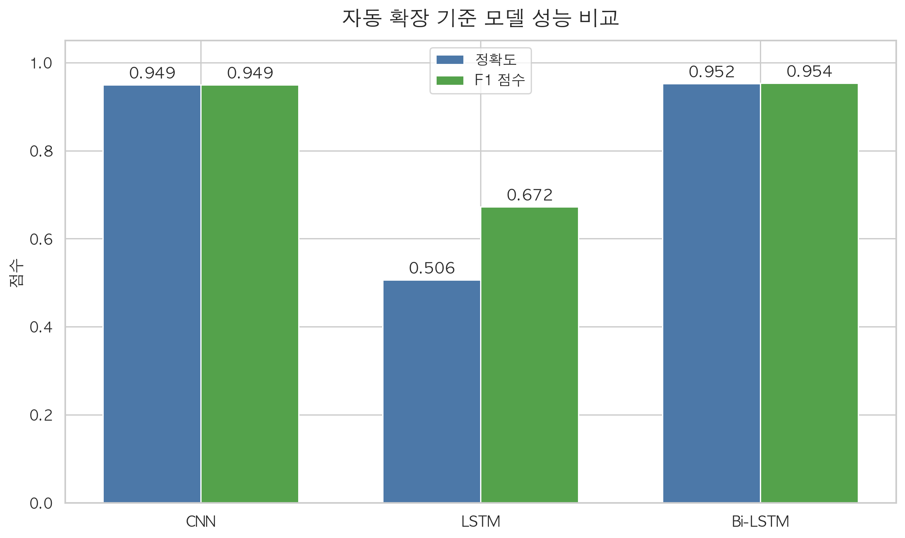
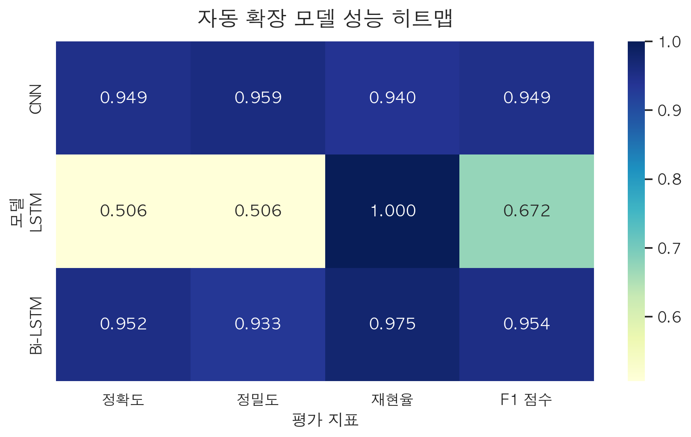
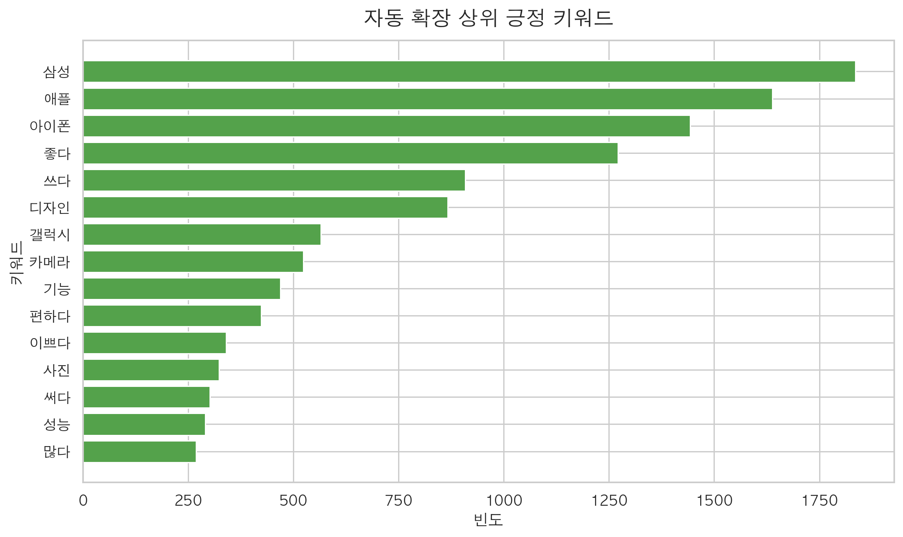
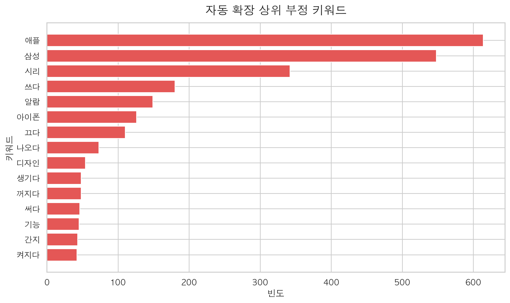
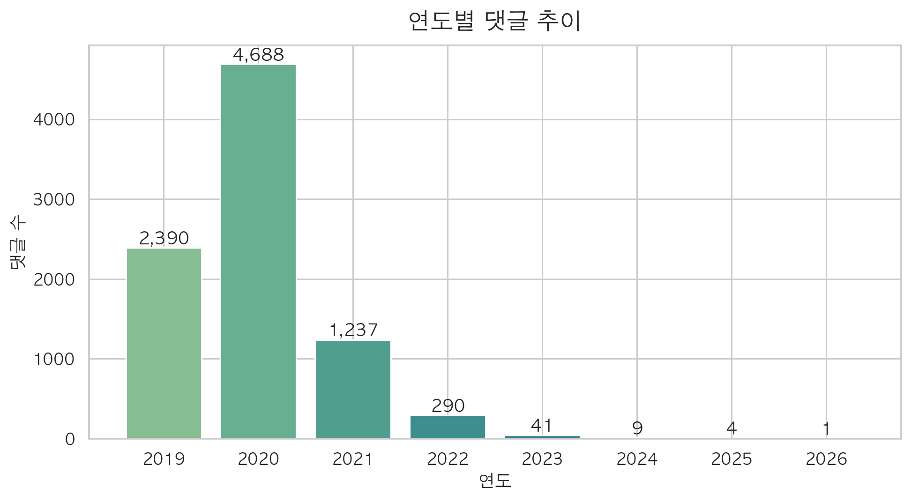
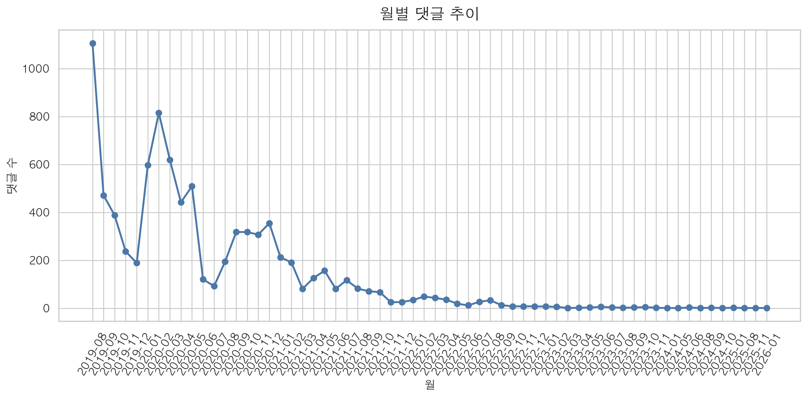

# 유튜브 댓글 감성분석 파이프라인

> 한국어 유튜브 댓글을 수집·전처리하여 CNN / LSTM / Bi-LSTM 모델로 긍정·부정을 분류하고 성능을 비교하는 NLP 파이프라인

<br>

## 프로젝트 개요

유튜브 댓글은 편향되거나 수가 적은 경우가 많아 **데이터 품질과 양**이 모델 성능에 직결됩니다.  
본 프로젝트는 수집 단계부터 모델 학습·평가까지 전 과정을 자동화하고, 세 가지 딥러닝 모델의 성능을 체계적으로 비교합니다.

<br>

## 파이프라인 구조

```
댓글 수집 → 텍스트 전처리 → 라벨링 → 형태소 분석(Okt) → 시퀀스 변환 → 모델 학습 → 평가·비교
```

<br>

## 모델 구조

| 모델 | 핵심 레이어 | 특징 |
|------|------------|------|
| CNN | Conv1D(128, kernel=5) + GlobalMaxPooling | 지역적 n-gram 패턴 포착 |
| LSTM | LSTM(64) | 순방향 시퀀스 의존성 학습 |
| Bi-LSTM | Bidirectional(LSTM(64)) | 양방향 문맥 동시 학습 |

<br>

## 주요 하이퍼파라미터

| 항목 | 값 |
|------|----|
| Vocab Size | 5,000 |
| Embedding Dim | 64 |
| Learning Rate | 1e-3 |
| Batch Size | 32 |
| Max Epochs | 12 |
| EarlyStopping patience | 3 |
| Train / Valid / Test | 70% / 15% / 15% |

<br>

## 전처리 상세

- HTML 태그, URL, 멘션 제거
- 한글·영문·숫자 외 문자 제거
- **한국어 포함 댓글만** 유지
- KoNLPy `Okt` — 명사·형용사·동사 추출 (2글자 이상, stem=True)
- 불용어 18개 제거 (진짜, 너무, 정말, 댓글, 영상 등)
- 자동 확장 라벨 파일 우선 사용, 없으면 수동 라벨 사용

<br>

## 시각화 결과

| | |
|---|---|
|  |  |
|  |  |
|  |  |
|  |  |

<br>

## 폴더 구조

```
📁 youtube-sentiment-analysis/
├── 📄 README.md
├── 📄 .gitignore
├── 📄 파이프라인.py
├── 📁 images/
└── 📁 report/
    └── 4조_보고서.html
```

<br>

## 실행 방법

```bash
pip install -r requirements.txt
python 파이프라인.py
```

> `comments.csv`, `comments_labeled.csv` 파일이 동일 경로에 있어야 합니다.

<br>

## 사용 기술


- **KoNLPy** (Okt) — 한국어 형태소 분석
- **TensorFlow / Keras** — 딥러닝 모델
- **scikit-learn** — 데이터 분할 및 평가 지표

<br>

---

**4조** · 인공지능 응용 프로젝트
